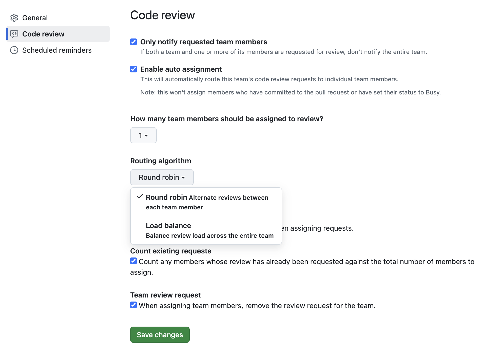

# 📚 개발 서적 스터디 회고

## 1. 스터디 목표

- 이번 스터디를 통해 얻고자 했던 목표는 무엇인가요?
  - 부수 효과를 잘 다루는 방법
  - 함수형 프로그래밍 찍어 먹어보기
    - 함수형 프로그래밍의 정의
    - 함수형 프로그래밍의 장점
    - 함수형 프로그래밍 기법 등
- 목표 달성에 어느 정도 성공했나요? (예: 70%, 90%)
  - 80%

## 2. 배운 점

- **기술적 성장**: 어떤 기술적 지식이 향상되었나요?
  - 액션과 계산을 구분하고 액션을 계산으로 만들 수 있는 방법을 알게 되었습니다!
  - 지금까지는 프로젝트를 할 때 관심사 별로 폴더만 나눠서 사용하고 있었는데, 로직의 흐름에 따라 코드를 어떻게 정리해야 할 지 아키텍처의 필요성을 알게 되었습니다.
  - 가독성 위주의 코드를 작성해왔는데 재사용하기 좋은 코드에 대해 생각해보게 되었습니다.
    - 어떻게 하면 더 일반적인 함수로 작성할 수 있을지
    - 함수가 많아질텐데 관리가 용이하려면 어떻게 해야 할 지
  - 상태 관리를 단순히 전역 상태를 관리한다는 초점에서 벗어나 타임라인적인 관점에서도 생각해볼 수 있게 되었습니다.
- **비기술적 성장**: 학습 습관, 협업 스킬, 시간 관리 등 비기술적 부분에서 무엇을 배웠나요?
  - 이전에 북 스터디를 할 때에는 책의 모든 내용을 정리해야겠다는 강박이 있었는데, 이 책은 구조적으로도 잘 짜여있고(챕터 정리, 챕터 시작할 때 다루게 될 내용 소개 등) 예시도 많아서 그런 강박에서 쉽게 벗어날 수 있었던 것 같습니다. 앞으로 책을 읽으며 정리할 때에도 이번 북 스터디 경험으로 더 편하게 핵심 내용을 정리할 수 있을 것 같아요!
  - 디스코드에서 발표 이후에 관련된 이야기를 나누면서 현업에 계신 개발자들과 취업 준비생 사이의 긴장이나 불안을 떨쳐내고 저의 생각을 자신있게 이야기하고 피드백 받을 수 있는 용기를 얻은 것 같습니다.

## 3. 어려웠던 점과 해결 방안

- **어려움**: 스터디 중 어려웠던 부분이 있었나요? (예: 특정 개념 이해, 실습 적용, 시간 부족 등)
  - 책 예시의 주제가 한 가지로 단편적이라고 느껴서 다른 도메인에서는 어떻게 함수형 프로그래밍을 적용해볼 수 있을지 추가적인 고민이 필요했던 것 같아요.
  - 리액트에서 이미 제공하고 있는 함수형 도구들과는 어떻게 잘 어우러지게 사용할 수 있을 지도 궁금했습니다.
- **해결 방안**: 이 어려움을 어떻게 해결했나요? 앞으로 어떻게 개선할 수 있을까요?
  - 함수형으로 작성된 다른 프로젝트(레퍼런스)를 찾아서 어디에 어떤 개념들이 적용되었는지 이야기해봤어도 재밌었을 것 같아요!
  - 함수형으로 다같이 프로젝트나 코드를 작성해보면서 피드백을 나눠보면 함수형을 더 잘 활용하게 될 수 있을 것 같아요.
  - 리액트에서의 함수형을 다루는 책이 있는지 찾아봤는데 아직은 없는 것 같네요 ㅜㅡㅜ

## 4. 개선점

- **스터디 방식 개선**: 스터디 진행 방식에서 개선할 점은 무엇인가요? (예: 더 많은 토론 시간 확보, 학습 진도 조절 등)
  - GitHub 조직에서 팀으로 생성하면 PR 생성할 때 랜덤으로 리뷰어를 선정해주는 기능이 있는데, 주차 별로 브랜치를 생성하고 머지하는 방식으로 스터디를 해봐도 좋을 것 같아요.
    - 주차 별 논의 사항들도 PR에 함께 이야기하기
    - 리뷰어로 선정된 사람이 발표 진행하기
      - 리뷰어 선정 알고리즘이 잘 돼있어서 발표도 공정하게 진행할 수 있을 것 같습니다!
        
- **추가 학습 필요성**: 추가적으로 학습이 필요하다고 느낀 부분이 있다면 무엇인가요?
  - 다른 함수형 도구는 어떤 것들이 있는지?
  - 아키텍처를 구성할 때 고려해야 할 것들은 무엇인지?
    - 다른 아키텍처들에 대한 탐구
  - 클로저를 적극적으로 활용해볼 수 있는 부분은 어떤게 있는지?

## 5. 다음 스터디 계획

- 다음 스터디에서 학습하고자 하는 주제나 내용은 무엇인가요?

  - 상태 관리
  - 타입 스크립트
  - 함수형 프로그래밍 딥다이브
  - 아키텍처 등

  - 향후 읽고 싶은 책
    - [프론트엔드 성능 최적화 가이드](https://product.kyobobook.co.kr/detail/S000200178292)
    - [자바스크립트+리액트 디자인 패턴](https://product.kyobobook.co.kr/detail/S000213880201)
    - [리액트 훅을 활용한 마이크로 상태 관리](https://product.kyobobook.co.kr/detail/S000212233308)
    - [우아한 타입스크립트 with 리액트](https://product.kyobobook.co.kr/detail/S000210716282)
    - [실용주의 프로그래머](https://product.kyobobook.co.kr/detail/S000001033128)
    - [내 코드가 그렇게 이상한가요?](https://product.kyobobook.co.kr/detail/S000202521361)
    - [켄트 벡의 Tidy First?: 더 나은 소프트웨어 설계를 위한 32가지 코드 정리법](https://product.kyobobook.co.kr/detail/S000212999739)

- 구체적인 실천 계획이 있다면 적어주세요.
  - 다음 진행하게 될 북 스터디와는 별개로 쏙함코를 한 번 더 읽을 계획입니다!  
    (이번에 개념 위주로 읽었다면, 다음에는 어떻게 하면 잘 적용/활용할 수 있을지 고민하면서 읽어볼 것 같아요!)

## 6. 마무리 소감

- 이번 스터디를 통해 느낀 소감이나 향후 학습에 대한 다짐을 적어주세요.
  - 너무 좋았습니다... 주차 별로 나눠진 챕터들도 주제에 맞게 잘 구성된 것 같았고,  
    실무자의 관점에서 해석한 내용들도 도움이 정말 많이 되었던 것 같아요.  
    다른 분들도 너무 잘하시고, 부담없이 대해주셔서 편안했던 스터디였습니다!  
    다들 너무 고생하셨고 감사했습니다 :)
